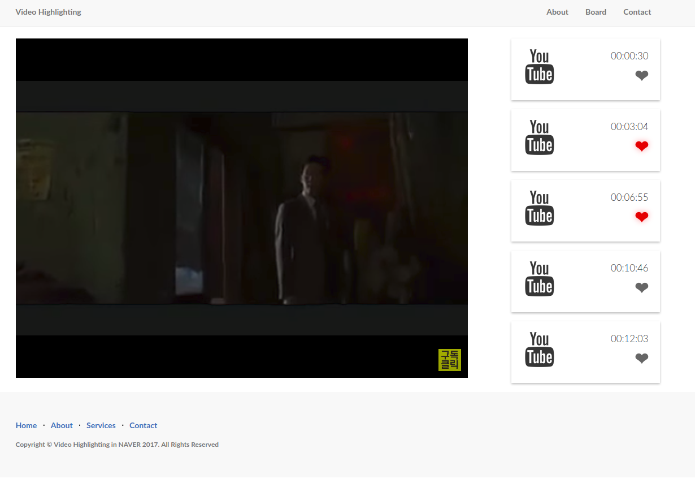

# VIDEO HIGHLIGHTING BY YOUTUBE

**'YOUTUBE HIGHLIGHT'** is an application utilizing the Web of React, Django Rest Framework

This Application collect user's action and make histogram data by user data
So you can choose highlight and application recommand highlight period according to collected data


## ScreenShot


---

## Getting Start (server)
**Server** is based on Python(Django Rest Framework)
- python 3.5
- django 1.10
- Numpy -> make histogram data by numpy
- Nginx reverse proxy :8000 port in rest server
- mysql(mariadb)

```bash
cd videoserver
python3 manage.py runserver 0.0.0.0:8000
```

```bash
├── videoserver/
  ├── videoserver/               <- django project folder
  ├── response/                  <- django app response folder
  ├── nginx                      <- nginx default setting
```

---

## Getting start (client)
**Client** is based on **[React]**
- node v8.0.0
- react
- create-react-app

```bash
cd videoclient
yarn install / npm install
yarn build, start / npm build / start
```

```bash
├── videoclient/
  ├── src/
    ├── components/              <- component folder
    ├── containers/              <- containers folder
    ├── lib/                     <- lib folder (axios and so on)
    ├── App.js                   <- App(web) entry file
  ├── node_modules               <- modules
  ├── package.json               <- mostly task runner dependencies
```
